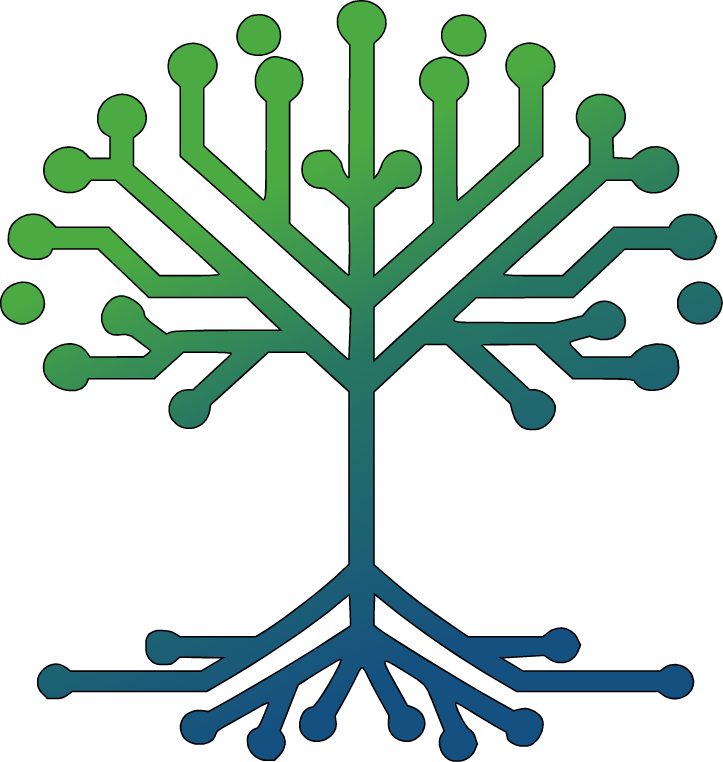
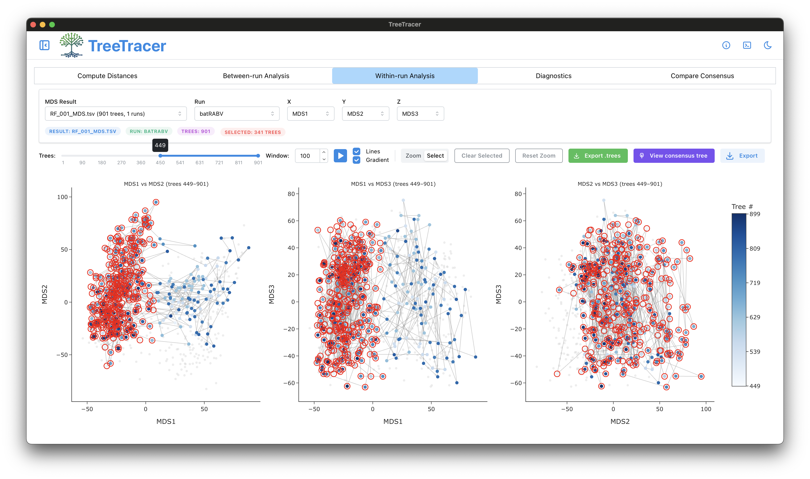

<p align="center">
  
</p>

<h1 align="center">TreeTracer</h1>

<p align="center">
  <em>A fast, friendly desktop app for exploring posterior tree space from MCMC runs</em>
</p>

<p align="center">
  <a href="https://github.com/beast-dev/treetracer/actions/workflows/ci.yml"></a>
  <a href="https://github.com/beast-dev/treetracer/releases"></a>
  
  <a href="LICENSE"></a>
</p>

<p align="center">
  
  
  
</p>

---

## Overview

TreeTracer checks whether an MCMC chain has converged and mixed well **in tree space**, not just in its parameter traces. Point it at the `.trees` files from a MCMC run (ie [BEAST X](https://beast.community/)) and it computes pairwise Robinson–Foulds distances, projects them with MDS, and plots the result so you can spot stuck chains, hidden modes, and poor mixing at a glance — between runs, within a run, and over time. The interface is quick to learn: load your trees, set a burn-in, and click through the tabs.

It's the companion to [Tracer](https://github.com/beast-dev/tracer): your `.log` files go into Tracer, your `.trees` files go into TreeTracer.

<p align="center">
  
</p>

### Highlights

- **Fast** — pairwise RF distances are computed by [`rapidtrees`](https://github.com/Joon-Klaps/rapidtrees), a balzing fast Rust-powered distance engine.
- **Simple interface** — no scripting: load `.trees` files, set a burn-in, and explore
- **Between & within-run views** — MDS projections reveal mixing, bimodality, and outlier chains
- **Diagnostics** — log-density traces, RF traces, and pseudo-ESS to judge whether you've sampled enough
- **Consensus comparison** — compare consensus trees across posterior modes to see which clades disagree
- **Cross-platform** — native installers for macOS and Windows, runs from source anywhere [`uv`](https://docs.astral.sh/uv/) does

---

## Documentation

For a full walkthrough — loading trees, setting burn-in, reading the MDS plots, and
interpreting pseudo-ESS — see the tutorial on the
[BEAST X community site](https://beast.community/analysing_beast_output.html#analysing-beast-output-using-treetracer).

---

## Download

The preferred way to get TreeTracer is the prebuilt installer for your platform — no Python
setup required.

| Platform | Installer |
| --- | --- |
| macOS (Apple Silicon) | `TreeTracer-<version>-arm64.dmg` |
| macOS (Intel) | `TreeTracer-<version>-x86_64.dmg` |
| Windows | `TreeTracer-<version>.msi` |
| Linux | not packaged yet — [install from source](#installing-from-source) below |

Grab the latest build from the **[Releases page](https://github.com/beast-dev/treetracer/releases)**.

---

## Installing from source

Prefer running from source, or on Linux? TreeTracer is a standard Python tool launched through
[`uv`](https://docs.astral.sh/uv/).

### 1. Install `uv`

```bash
# macOS / Linux
curl -LsSf https://astral.sh/uv/install.sh | sh

# macOS (Homebrew alternative)
brew install uv

# Windows (PowerShell)
powershell -ExecutionPolicy ByPass -c "irm https://astral.sh/uv/install.ps1 | iex"
```

Open a new shell so `uv` picks up its install path, then `uv --version` should print a version
number.

### 2. Clone and launch

#### macOS / Windows

```bash
git clone https://github.com/beast-dev/treetracer.git
cd treetracer
uv run treetracer
```

#### Linux

`pywebview` needs the system GTK / WebKit libraries plus Python bindings that compile against
them. Install the system headers first:

```bash
# Ubuntu 24.04+
sudo apt install libwebkit2gtk-4.1-dev gir1.2-webkit2-4.1 \
    gir1.2-gtk-3.0 libgirepository-2.0-dev libcairo2-dev \
    pkg-config zenity

# Ubuntu 22.04 (older WebKit ABI)
sudo apt install libwebkit2gtk-4.0-dev gir1.2-webkit2-4.0 \
    gir1.2-gtk-3.0 libgirepository-1.0-dev libcairo2-dev \
    pkg-config zenity
```

Then clone and add the Python bindings into the project venv:

```bash
git clone https://github.com/beast-dev/treetracer.git
cd treetracer
uv add PyGObject pycairo
uv run treetracer
```

**No root / no apt?** Skip the system-headers step and use the Qt backend instead:

```bash
uv add qtpy pyqt6 pyqt6-webengine
uv run treetracer
```

Prefer a browser tab over the native window? `uv run treetracer --browser` works on any platform.

---

## Updating / removing

```bash
# Update
cd treetracer
git pull
uv run treetracer   # uv re-syncs automatically once uv.lock has changed

# Remove
rm -rf treetracer/   # removes the project venv too
uv cache clean       # optional — frees uv's package cache
```

---

## License

TreeTracer is provided under the [GNU GPLv3](LICENSE).
